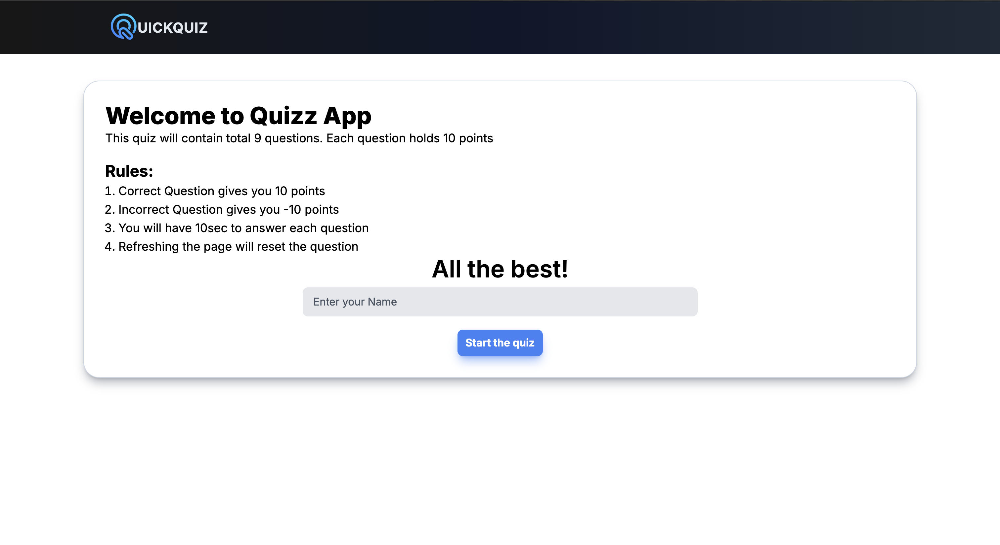
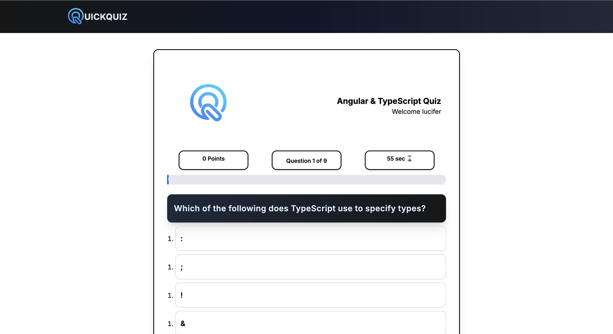
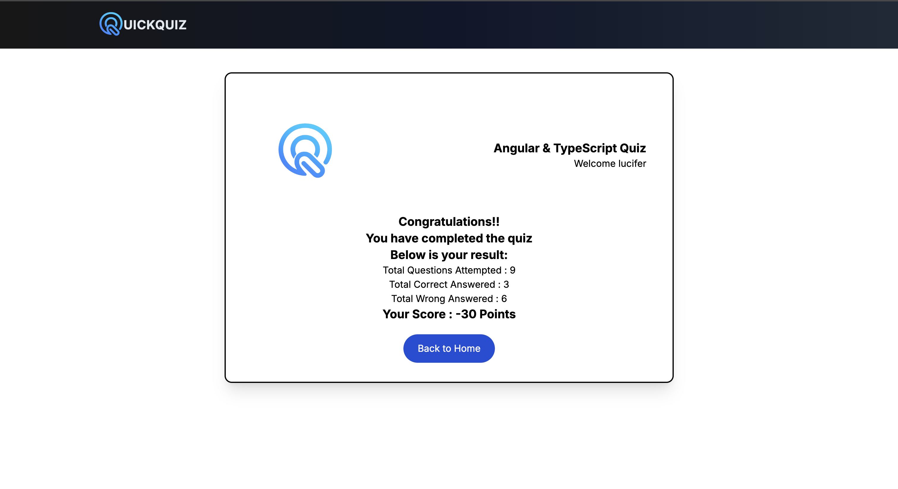

# QuickQuiz — A Modern Angular Quiz App 🧠✨

QuickQuiz is a sleek and responsive quiz application built using **Angular** and **TypeScript**. It features real-time score updates, timer tracking, gradient-themed question cards, and a minimalist UI for a smooth user experience.

---

## 🚀 Features

- 💡 Multiple choice questions with instant feedback
- 🎯 Real-time scoring and progress tracking
- ⏱️ Countdown timer per question
- 📊 Visual progress bar
- 📱 Responsive design for mobile and desktop
- 🌈 Gradient-themed UI with smooth transitions

---

## 🛠️ Built With

- [Angular](https://angular.io/)
- [TypeScript](https://www.typescriptlang.org/)
- [RxJS](https://rxjs.dev/)
- SCSS / TailwindCSS

---

## 📁 How to Run Locally

```bash
# Clone the repository
git clone https://github.com/lucifer198/QuickQuiz---A-quiz-app.git
cd QuickQuiz---A-quiz-app

# Install dependencies
npm install

# Run the app
ng serve
```

Then open `http://localhost:4200` in your browser to start the quiz!

---

## 📷 Screenshots

Here’s a quick look at the UI:

### 🟢 Start Page


### 🟣 Question Interface


### 🏁 Completion Screen



---

## 🙌 Credits

This version of QuickQuiz was customized and enhanced by [lucifer198](https://github.com/lucifer198).

Originally adapted and redesigned with additional features, layout improvements, and personalization.

